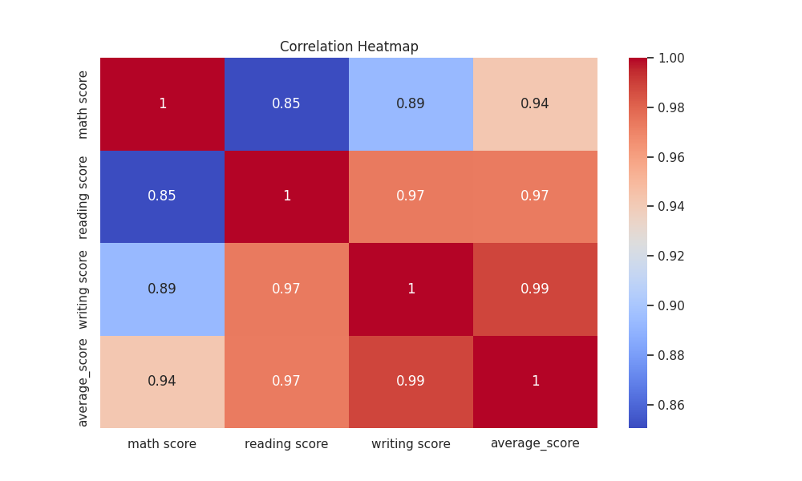
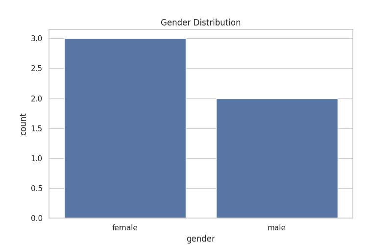

# 🎓 Student Academic Performance Analysis

This project analyzes student performance data to uncover patterns and insights using Python and data visualization techniques.

## 📂 Files

- `student_performance_analysis.ipynb` — Colab notebook with full code
- `student_performance.csv` — Cleaned dataset used in the project
- `heatmap.png` — Correlation heatmap visualization
- `gender_distribution.png` — Gender-wise student distribution
- `README.md` — Project overview and explanation

## 📊 Objective

To explore how different factors like gender, parental education, and test preparation impact academic scores in math, reading, and writing.

## 🧠 Skills Applied

- Data Cleaning (`dropna`, `isnull`)
- Exploratory Data Analysis (EDA)
- Grouping and Aggregations
- Data Visualization with `Matplotlib` and `Seaborn`

## 📌 Key Insights

- Students who completed a test preparation course scored higher on average.
- Gender distribution shows more females in this dataset.
- Parental level of education shows an influence on student performance.

## 🛠️ Technologies Used

- Google Colab
- Python (Pandas, Matplotlib, Seaborn)

## 🚀 Future Scope

- Add Machine Learning models for prediction
- Deploy as a Streamlit app or Flask web app

## 📸 Sample Visualizations

---

## 👨‍💻 Author

B.Tech CSE (AI & ML) Student — Final Year  
Rishabh gupta

